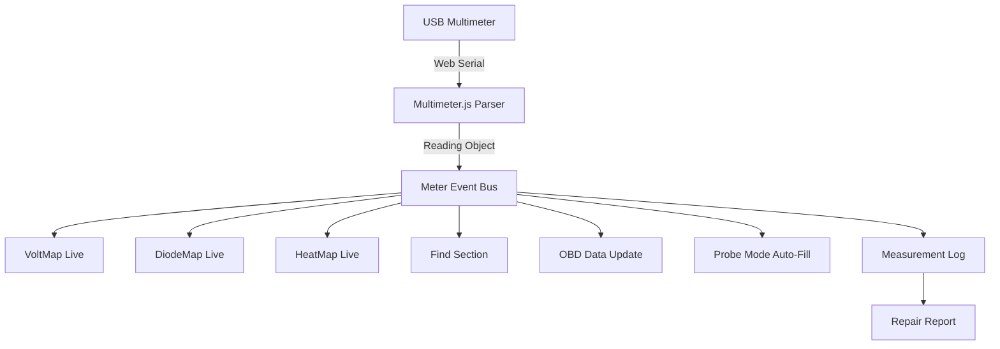

# BoardScope Multimeter Deep Integration Plan

## Overview

The multimeter is now connected via Web Serial API with FS9721 protocol support. The next step is to deeply integrate live meter readings into BoardScope's core features: **VoltMap**, **DiodeMap**, **HeatMap**, **Find/Search**, and **OBD Data**.

---

## Architecture



---

## Feature 1: VoltMap Live Integration

**Current behavior:** VoltMap colours nets based on OBD reference voltage data.

**New behavior:** When a multimeter is connected and in DCV mode, clicking a net or component automatically records the voltage reading and updates the VoltMap colour in real-time.

**Implementation:**
- Add `meter:reading` event listener that checks if VoltMap is active
- If VoltMap is active and meter mode is DCV/ACV/mV, auto-assign reading to the currently active net
- Update `G.obd.netData` with the live reading
- Trigger `drawBRD()` to repaint with new colours
- Add a "LIVE" badge to the VoltMap legend when meter is connected

**UI changes:**
- VoltMap legend shows "LIVE" indicator when meter is streaming
- Nets being measured get a pulsing border animation

---

## Feature 2: DiodeMap Live Integration

**Current behavior:** DiodeMap colours nets based on OBD diode-mode reference data.

**New behavior:** When meter is in DIODE or CONT mode, clicking a net records the diode reading and updates the DiodeMap colour instantly.

**Implementation:**
- Same event bus pattern as VoltMap
- When meter mode is DIODE/CONT and DiodeMap is active, auto-record to active net
- Update `G.obd.netData` with diode value
- Repaint DiodeMap colours

**UI changes:**
- DiodeMap legend shows "LIVE" indicator
- Nets with live diode readings show the value overlay on the board

---

## Feature 3: HeatMap Live Integration

**Current behavior:** HeatMap compares local measurements against OBD reference and colour-codes by deviation.

**New behavior:** Live meter readings automatically update the HeatMap as you probe, giving instant visual feedback on whether each reading is good or bad.

**Implementation:**
- When HeatMap is active and meter is connected, each new reading updates `G.localMeas`
- Auto-compare against OBD reference value
- Repaint HeatMap immediately
- Add a "scan sweep" mode: hold the probe on a net and watch the colour update in real-time

**UI changes:**
- HeatMap legend shows live reading count
- Add a "FREEZE" button to pause live updates for analysis

---

## Feature 4: Find Section Integration

**Current behavior:** Search finds components by ref, net, side, or pin number.

**New behavior:** Add search filters for measurement state:
- `meter:v` — find nets with voltage readings
- `meter:d` — find nets with diode readings
- `meter:ol` — find nets reading OL (open/short)
- `meter:bad` — find nets where live reading differs from OBD reference
- `meter:good` — find nets matching OBD reference within tolerance

**Implementation:**
- Extend the search parser to recognize `meter:` prefix
- Filter `G.obd.netData` and `G.localMeas` based on meter criteria
- Highlight matching nets on the board

**UI changes:**
- Add meter filter buttons to the Find section dropdown
- Search placeholder hints show meter filter options

---

## Feature 5: OBD Data Live Update

**Current behavior:** OBD data is loaded from a file and is static.

**New behavior:** When a multimeter is connected, offer to create or update a local OBD data file with live measurements. This becomes a "golden board" reference.

**Implementation:**
- Add "RECORD AS OBD" button to the multimeter bar
- When clicked, saves the current live reading as the OBD reference for the active net
- Builds `G.obd.netData` incrementally as you probe the board
- Export as `.obdata` file when done
- Compare mode: show side-by-side of loaded OBD vs newly recorded live OBD

**UI changes:**
- New button in multimeter bar: "RECORD AS OBD"
- OBD panel shows count of live-recorded nets vs loaded nets
- Export button for "MY OBD" (recorded reference data)

---

## Feature 6: Guided Measurement Workflow

**Current behavior:** User manually clicks pads, types values, saves.

**New behavior:** With meter connected, the workflow becomes:
1. Select a net/component (via search, click, or sidebar)
2. Touch probe to pad
3. Meter reading auto-captured and saved
4. Board view updates colour map instantly
5. Move to next net

**Implementation:**
- Add "AUTO-CAPTURE" toggle in multimeter bar
- When enabled, any stable reading (held for >1 second) on a selected net is auto-saved
- Debounce to prevent duplicate saves
- Audible/visual confirmation when saved

---

## Implementation Order

```mermaid
gantt
    title Multimeter Integration Phases
    dateFormat  X
    axisFormat %s

    section Phase 1
    Meter Event Bus              :0, 1
    OBD Data Live Update         :1, 2
    Probe Mode Auto-Fill Enhance :2, 3

    section Phase 2
    VoltMap Live                 :3, 4
    DiodeMap Live                :4, 5
    HeatMap Live                 :5, 6

    section Phase 3
    Find Section Meter Filters   :6, 7
    Guided Measurement Workflow  :7, 8
    Export Recorded OBD          :8, 9
```



---

## Data Flow

```
Meter Reading → Event Bus → Active Net → G.localMeas → G.obd.netData → drawBRD()
                                                              ↓
                                                    VoltMap/DiodeMap/HeatMap
                                                              ↓
                                                    Colour-coded board view
```

---

## Key State Variables

| Variable | Purpose |
|----------|---------|
| `G_meter` | Multimeter instance |
| `G_meterAutoFill` | Auto-fill toggle for probe mode |
| `G_meterAutoCapture` | Auto-save readings to active net |
| `G_meterActiveNet` | Currently selected net for meter |
| `G_meterReadingHistory` | Array of recent readings for debounce |

---

## Files to Modify

| File | Changes |
|------|---------|
| `multimeter.js` | Add event bus, debounce logic, stable reading detection |
| `boardview.html` | Add UI elements, wire up all 6 features, update search |
| `server.js` | No changes needed (static file serving already works) |

---

## Testing Plan

1. **FS9721 Parser Validation:** Test with known byte sequences from FS9721 spec
2. **Web Serial Fallback:** Grace error handling when serial not available
3. **Map Toggle:** Verify VoltMap/DiodeMap/HeatMap update correctly with live data
4. **Search Filters:** Test all `meter:` filter patterns
5. **OBD Export:** Verify exported `.obdata` file is valid and re-importable
